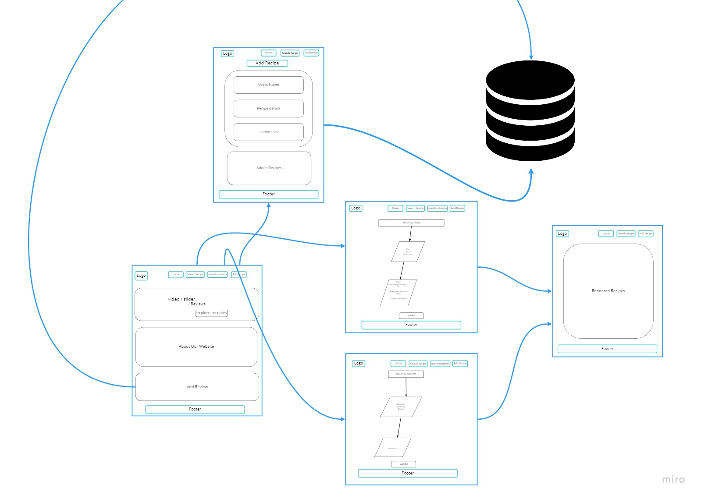

# Food-ish

**Group Members :**
1. Dawood basher
2. Anwar Shraideh
3. Emran Aloul
4. Sewar Ahmad
5. Yasmeen Al-khateeb

## Website Idea: 
The main idea for the website is to enable users to search for recipes according to some specification, like recipes for vegetarian or vegan diets, or recipes with specific nutritional specifications like the amount of carbs or the amount of fat and so on. 
Also the user can share his own recipes as well, and write recipes reviews.

## User Story:

**Feature One :**
As a user I want to be able to search recipes according to different criterias, like diet type, cuisine, and ingredients. I want my searched recipes to be shown with full description and an image.

**Feature Tasks:**
Create a form to specify the type of recipe.
Show a dynamic list to choose recipes.
Show recipes with full description and images.

**Feature Two:**
As a user I want to be able to look for recipes that have a certain amount of nutritional value, so I want to be able to determine the amount of carbs or protein or fat I want in the recipe.

**Feature Tasks:**
Create a form to specify the type of recipe.
Show a dynamic list to choose recipes.
Show recipes with full description and images.

**Feature Three:**
As a user I want to be able to share my own recipes with other users, so I would like to have to add recipes and also see other people's recipes. 

**Feature Tasks:**
Create a form to add recipe details.
Give the user the ability to add images to the recipe.
Show recipes with full description and images.

**Feature four:**
As a user i want the website to have amazing designs, and also some animations to be included as well.

**Feature Tasks:**
Design the website with suitable colours, layout and display.
Add animation in some of the pages .

**Feature five:**
As a user I want to be able to see the nutritional values within a certain dish, so when i enter a dish name, to know the amount of carbs, fat, protein, and calories within that dish. 

**Feature Tasks:**
Create a form to add recipe details.
Give the user the ability to add images to the recipe.
Show recipes with full description and images.

